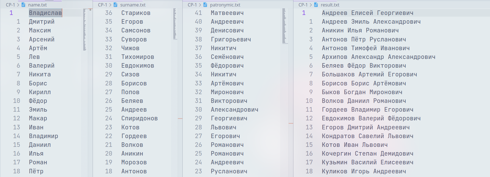

# Самостоятельная работа № 1

## Вариант 1 - Дневник
Конечная цель задачи - создать программу для ведения дневника, в котором пользователь может создавать несколько записей.

Требования:
* При запуске программы пользователь должен иметь возможность выбрать режим "добавления новой записи" или "просмотра существующих записей".
* При добавлении новой записи пользователь должен вводить дату и текст записи.
* Для хранения записей нужно использовать файл.
* (доп.) Пользователь должен иметь возможность удалить или отредактировать любую запись.
* (доп.) При запуске программы в режиме "просмотра существующих записей" пользователь должен иметь возможность выбрать определенную дату и просмотреть все записи, созданные в этот день.
---
## Вариант 2 - Учет расходов
Конечная цель задачи - создать программу для учета расходов, в которой пользователь может создавать несколько записей о своих расходах за день.

Требования:
* При запуске программы пользователь должен иметь возможность выбрать режим "добавления расхода" или "просмотра расходов".
* При добавлении новой записи пользователь должен вводить дату и сумму дохода/расхода (расход, если число отрицательное).
* Для хранения записей нужно использовать файл.
* При выводе расходов, нужно также вывести общую сумму всех доходов/расходов.
* (доп.) Пользователь должен иметь возможность удалить или отредактировать любую запись.
* (доп.) При запуске программы в режиме "просмотра существующих транзакций" пользователь должен иметь возможность выбрать определенную дату и просмотреть все доходы/расходы, созданные в этот день.
---
## Вариант 3 - Список задач
Конечная цель задачи - создать программу для управления списком дел, в которой пользователь может создавать, просматривать и изменять список своих задач.

Требования:
* При запуске программы пользователь должен иметь возможность выбрать режим "добавления новой задачи" или "просмотра существующих задач".
* При добавлении новой задачи пользователь должен вводить текст задачи и ее дедлайн.
* Для хранения записей нужно использовать файл.
* Каждую задачу нужно выводить со своим порядковым номером.
* (доп.) Пользователь должен иметь возможность отметить задачу, как выполненную, технически, удалив её из списка.
* (доп.) При запуске программы в режиме "просмотра существующих задач" нужно выводить задачи в порядке возрастания даты дедлайна (то есть сначала самые срочные).
---
## Доп. задача (ДЗ)
<br>
Даны файлы, где перечислены имена (name.txt), фамилии (surname.txt) и отчества (patronymic.txt). Сопоставить фамилию, имя и отчество, чтобы было соответствие (фамилия №1, имя №1, отчество №1). Затем №2 и т.д. Количество итоговых ФИО равно минимальному из количеств записей в этих 3 файлах. Иными словами, генерировать надо, пока не закончится хотя бы один из файлов. После генерации ФИО, нужно отсортировать их по алфавиту и вывести в файл result.txt.
Важно: в программу нельзя забивать размер файла, т.е. она должна работать корректно, даже если в файл что-то добавить\убрать.
Должно получиться так:



---

## Справка
Если хотите, чтобы программа дописывала в конец файла, а не удаляла его содержимое при повторном открытии, используйте такой код:
```c++
ofstream fout("filename.txt", ios::app);
```
> Именно `ios::app` позволяет дописывать в конец.

---

Напоминаю, что чтение строки целиком осуществляется так:
```c++
getline(fin, myString);
```