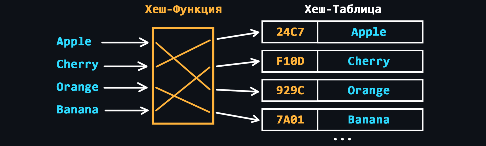

# Работа с `map` в C++

`map` - это контейнер, который хранит пары ключ-значение. Ключи уникальны, т.е. каждый ключ может быть связан только с одним значением. Ключи в `map` автоматически сортируются в порядке возрастания.

Для работы с `map` в C++ необходимо подключить заголовочный файл map:

```cpp
#include <map>
```
## Создание map

Создать пустой `map` можно с помощью конструктора по умолчанию:

```cpp 
map<string, int> myMap;
//    ^      ^
//    |      |
// Ключ   Значение
```
Эта строка создает пустой `map`, который будет хранить пары ключ-значение, где ключом является string, а значением - int.
Добавление элементов

Элементы можно добавлять в `map` с помощью оператора []:

```cpp
myMap["key1"] = 1;
myMap["key2"] = 2;
```
Этот код добавляет две пары ключ-значение в `map`: "key1" со значением 1 и "key2" со значением 2.
Доступ к элементам

К элементам `map` можно обращаться с помощью оператора []:

```cpp
int value = myMap["key1"];
```
Этот код получает значение элемента `map` с ключом "key1". Если элемент с таким ключом не найден, то он будет создан со значением по умолчанию (0 для типа int).
Проверка наличия элемента

Чтобы проверить наличие элемента в `map`, можно воспользоваться методом count():

```cpp
if (myMap.count("key1")) {
    // элемент найден
}
```
Этот код проверяет, содержит ли `map` элемент с ключом "key1".
Удаление элемента

Элементы можно удалять из `map` с помощью метода erase():

```cpp
myMap.erase("key1");
```
Этот код удаляет элемент `map` с ключом "key1".

## Итерирование по элементам

Чтобы перебрать все элементы `map`, можно использовать итераторы:

```cpp
for (auto it = myMap.begin(); it != myMap.end(); ++it) {
    cout << it->first << " : " << it->second << endl;
}
```

Этот код выводит на экран все элементы `map` в порядке возрастания ключей.
## Использование

Ассоциативный контейнер ``map`` в C++ часто используется в тех случаях, когда требуется хранить пары ключ-значение и обеспечивать быстрый доступ к значениям по ключу. Ниже приведены некоторые примеры использования `map`:

* Счетчики слов: `map` может использоваться для подсчета количества вхождений каждого слова в текстовом документе. Ключом будет слово, а значением - количество вхождений слова в документ.

* Хранение информации о студентах: `map` может использоваться для хранения информации о студентах, где ключом будет идентификатор студента, а значением - объект, содержащий информацию о студенте, такую как имя, фамилия, оценки и т.д.

* Реестр настроек: `map` может использоваться для хранения настроек программы. Ключом будет имя параметра, а значением - его значение.

* Хранение графов: `map` может использоваться для хранения графов, где ключом будет вершина, а значением - список смежных вершин.

* Работа со словарями: `map` может использоваться для хранения перевода слов. Ключом будет слово на одном языке, а значением - его перевод на другой язык.

* Телефонная книга


Это только некоторые из возможных примеров использования `map`. Общее правило - если необходимо хранить пары ключ-значение и быстро получать доступ к значению по ключу, то `map` может быть хорошим выбором для решения задачи. `map` может быть полезен для хранения пар ключ-значение, например, для хранения словарей или частот слов в тексте.

# Unordered Map

`std::map` и `std::unordered_map` - это два различных ассоциативных контейнера в языке C++, каждый из которых имеет свои преимущества и недостатки. Они отличаются способом хранения и доступа к элементам, а также временем выполнения различных операций.
## Хранение элементов

`map` использует красно-черное дерево для хранения элементов, что обеспечивает логарифмическое время доступа к элементам (O(log n)) для всех операций, включая вставку, удаление и поиск. Красно-черное дерево гарантирует, что элементы будут отсортированы по ключу в порядке возрастания.

`unordered_map`, с другой стороны, использует хеш-таблицу для хранения элементов, что обеспечивает почти константное время доступа к элементам (O(1)) в лучшем случае. Хеш-таблица не гарантирует порядок элементов в контейнере, так как элементы могут быть расположены в произвольном порядке, в зависимости от хеш-функции.



## Время выполнения операций

Операции в `map` выполняются за логарифмическое время, так как элементы хранятся в отсортированном порядке. Операции в `unordered_map` выполняются за почти константное время, но могут быть медленнее, если происходят коллизии, то есть если два ключа имеют одинаковый хеш.
## Выбор контейнера

Выбор между `map` и `unordered_map` зависит от конкретной задачи. Если нужно сохранить элементы в порядке возрастания по ключу или если требуется гарантированное время выполнения операций, не зависящее от размера контейнера, то `map` может быть лучшим выбором.

Если требуется быстрый доступ к элементам и порядок их расположения в контейнере не имеет значения, то `unordered_map` может быть более эффективным выбором.
## Примеры использования

* `map` может быть использован для хранения словарей, отображающих строки на значения. Он может использоваться для хранения индексов векторов или массивов, а также для сортировки и поиска данных.

* `unordered_map` может быть использован для хранения кэша данных, где быстрый доступ к элементам является критически важным. 