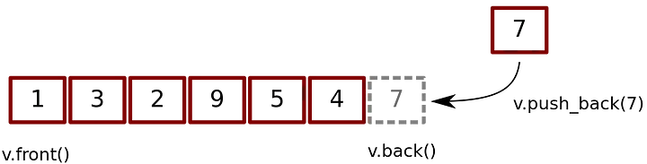

### 1.2 Vector `std::vector`
**Use for**
* Simple storage
* Adding but not deleting
* Serialization
* Quick lookups by index
* Easy conversion to C-style arrays
* Efficient traversal (contiguous CPU caching)

**Do not use for**
* Insertion/deletion in the middle of the list
* Dynamically changing storage
* Non-integer indexing

**Time Complexity**

| Операция             | Сложность       |
|----------------------|-----------------|
| Вставка в начало     |          `O(n)` |
| Вставка по индексу   |          `O(n)` |
| Вставка в конец      |          `O(1)` |
| Удаление из начала   |          `O(n)` |
| Удаление по индексу  |          `O(n)` |
| Удаление из конца    |          `O(1)` |
| Получение по индексу |          `O(1)` |
| Поиск по значению    |          `O(n)` |

**Example Code**
```c++
vector<int> v;    // Вектор целых чисел
vector<float> v;  // Вектор дробных чисел
vector<char> v;   // Вектор символов
vector<string> v; // Вектор строк
vector< pair<int, int> > v; // Вектор пар целых чисел
vector< vector<int> > v;    // Вектор векторов (двумерный массив)

//---------------------------------
// General Operations
//---------------------------------

// Size
unsigned int size = v.size();

// Insert head, index, tail
v.insert(v.begin(), value);             // вставка в начало
v.insert(v.begin() + index, value);     // вставка по индексу
v.push_back(value);                     // вставка в конец
```

```c++
// Access head, index, tail
int head = v.front();       // head
head = v[0];                // or using array style indexing

int value = v.at(index);    // index
value = v[index];           // or using array style indexing

int tail = v.back();        // tail
tail = v[v.size() - 1];     // or using array style indexing

// Обход вектора
for(std::vector<int>::iterator it = v.begin(); it != v.end(); it++) {
    std::cout << *it << std::endl;
}
// Можно сократить до:
for(auto it = v.begin(); it != v.end(); it++) {
    std::cout << *it << std::endl;
}

// Можно также использовать foreach:
for(auto it : v) {
    std::cout << it << std::endl;
}

// Remove head, index, tail
v.erase(v.begin());             // head
v.erase(v.begin() + index);     // index
v.pop_back();                   // tail

// Clear
v.clear();
```