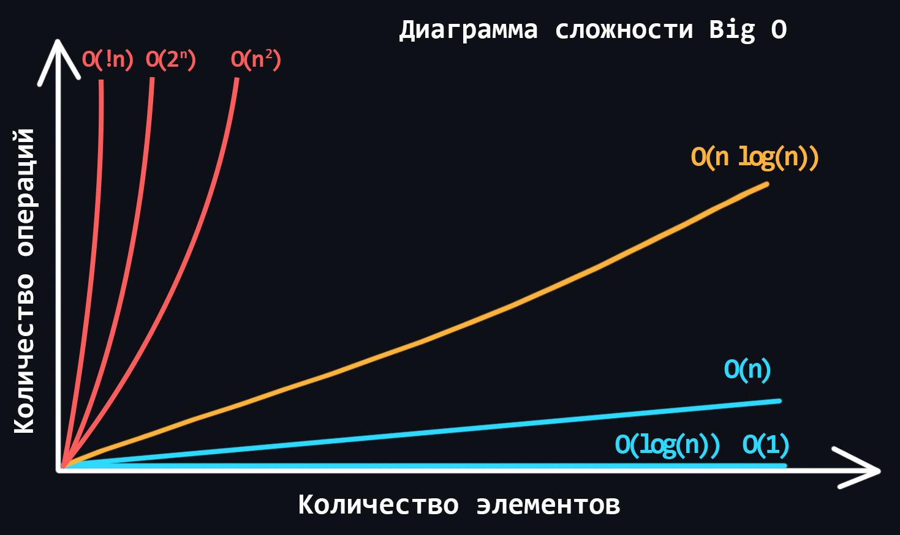

-   ### Оценка сложности алгоритмов

    <p align="center"></p>

    В мире программирования существует специальная единица измерения **Big О** (Большое О или О-нотация). Она описывает то, как сложность алгоритма растёт с увеличением количества входных данных. **Big O** оценивает то, сколько действий (шагов/итераций) необходимо совершить для выполнения алгоритма, при этом всегда показывая худший вариант развития событий. 

    -   Разновидности сложности алгоритмов
        > - Константная - O(1) <br>
        > - Линейная - O(n) <br>
        > - Логарифмическая - O(log n) <br>
        > - Линеарифметическая - O(n * log n) <br>
        > - Квадратичная - O(n^2) <br>
        > - Степенная - О(2^n) <br>
        > - Факториальная - O(!n) <br>

    -   Примеры сложности алгоритмов
    ```c++
    // Константная сложность
    int n = a * b;

    // Логарифмическая сложность
    for (int i = 1; i < n; i *= 2) {
        cout << i << endl;
    }

    // Линейная сложность
    for (int i = 0; i < n; i++) {
        cout << i << endl;
    }

    // Линеарифметическая сложность
    for (int i = 0; i < n; i++) {
        for (int j = 1; j < n; j *= 2) {
            cout << i << " " << j << endl;
        }
    }

    // Квадратичная сложность
    for (int i = 0; i < n; i++) {
        for (int j = 0; j < n; j++) {
            cout << i << " " << j << endl;
        }
    }

    // Степенная сложность
    for (int i = 0; i < (1 << n); i++) {
        cout << i << endl;
    }

    // Факториальная сложность (жесть)
    for (int i = 0; i < fact(n); i++) {
        cout << i << endl;
    }
    ```

Какую сложность имеет алгоритм, который проверяет, является ли число простым?

Какую сложность имеет алгоритм, который проверяет, является ли число палиндромом?

Какую сложность имеет алгоритм поиска максимального элемента в массиве?

Выберите правильный вариант создания двумерного массива:

```c++
int a[10][10];
int a[10][10] = {0};
int a[10][
```
