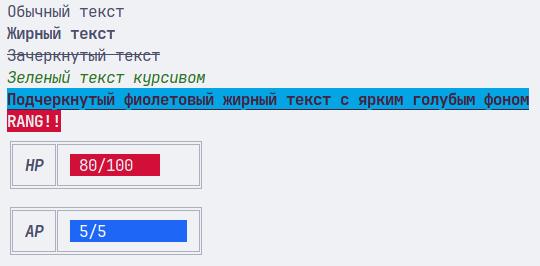
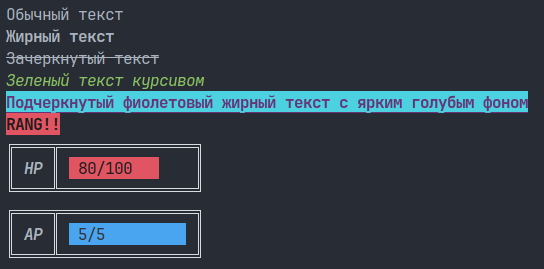

# Библиотеки ❤️

Библиотека - готовый модуль, который можно подключить и использовать. Также её называют либа или либина (от англ. lib

Вы можете упрощать себе жизнь, используя уже написанный другими людьми код. Например, вы хотите создать сервер, но на чистых плюсах это очень трудно, встроенных библиотек не хватает. Поэтому можно найти **стороннюю библиотеку**, которая позволит это сильно упростить.

Обычно для работы с либами нужна система сборки, например CMake. Причина в том, что там есть .cpp файлы. Для нас это пока довольно сложно, поэтому я подобрал для вас такие библиотеки, которые подключаются простым инклюдом с указанием пути к файлу.

Такие либы называются header-only, то есть просто скачал файл(ы), подключил заголовок и всё работает.

> [!IMPORTANT]
> Обратите внимание, что при подключении файлов, лежащих не в недрах системы, а в вашем проекте, используются `""` вместо `<>`. Последний ищет только в системных каталогах.

## Полезные библиотеки

- <https://github.com/agauniyal/rang> - вывод цветного и стилизованного текста
- <https://github.com/lava/matplotlib-cpp> - вывод вообще любых графиков (не в консоль!), даже 3D.
- <https://github.com/yhirose/cpp-peglib> - обработка арифметических выражений. Решит пример (2 + 2) * 2
- <https://github.com/okdshin/PicoSHA2> - генератор хеша SHA-256. Нужно для криптографии
- <https://github.com/p-ranav/indicators> - вывод прогрессбаров
- <https://github.com/CrowCpp/Crow> - собственный сервер, к которому можно прислать запрос через браузер
- <https://github.com/libcpr/cpr> - отправка запросов в сеть. Нужен Cmake
- <https://github.com/martinRenou/terminal> - считывание нажатий клавиш и многое другое

## Пример работы с библиотекой rang

```cpp
// Нужно скачать этот файл и поместить рядом с вашим. Ссылка на репозиторий:
// https://github.com/agauniyal/rang

// Команда терминала для скачивания файла на реплите/линуксе/маке:
// curl -O https://raw.githubusercontent.com/agauniyal/rang/master/include/rang.hpp

#include "rang.hpp"
#include <iostream>

using namespace std;
using namespace rang;

int main()
{
    cout << "Обычный текст" << endl;

    cout << style::bold << "Жирный текст" << style::reset << endl;

    cout << style::crossed << "Зачеркнутый текст" << style::reset << endl;

    cout << style::italic << fg::green << "Зеленый текст курсивом" << style::reset
         << endl;

    cout << style::underline << style::bold << fg::magenta << bgB::cyan
         << "Подчеркнутый фиолетовый жирный текст с ярким голубым фоном"
         << style::reset << endl;

    cout << style::bold << bg::red << fg::gray << "RANG!!" << style::reset
         << endl;

    cout << fg::gray << "╔════╦═══════════════╗\n";
    cout << "║ ";
    cout << style::bold << style::italic << fg::reset << "HP " << style::reset;
    cout << fg::gray << "║ ";
    cout << bg::red << fg::gray << " 80/100   " << style::reset << "    " << fg::gray << "║" << endl;
    cout << fg::gray << "╚════╩═══════════════╝\n";

    cout << fg::gray << "╔════╦═══════════════╗\n";
    cout << "║ ";
    cout << style::bold << style::italic << fg::reset << "AP " << style::reset;
    cout << fg::gray << "║ ";
    cout << bg::blue << fg::gray << " 5/5         " << style::reset << fg::gray << " ║" << endl;
    cout << fg::gray << "╚════╩═══════════════╝\n";
}
```




## Задание

1. Подключить библиотеку rang и вывести что-нибудь интересное в цветах и со стилями. Только не `Hello world`. Проявите же оригинальность. Творите!

2. Подключить библиотеку indicators. Да, тут уже нет пошаговой инструкции от меня. Используйте накопленные знания! Я же дал вам ссылку на их гитхаб, моя совесть чиста... <br>`#include` не видит файл? Не зовите меня сразу, подумайте несколько минут, перечитайте теоретический материал. В гайде от автора либы файл подключается так, будто библиотека установлена в систему. Это не наш случай.

> Чтобы легко скачать репозиторий Github на реплит, напишите `git clone "ссылка на репозиторий"`

Например, для скачивания picoSHA мы пишем
> `git clone https://github.com/okdshin/PicoSHA2`

## Подключаем не-header-only библиотеку через CMake

1. Создать чистый реплит
2. Создать там файл `CMakeLists.txt`, поместить туда содержимое такого же файла в папке `Обращение в сеть`.
3. С `main.cpp` сделать то же самое.
4. C `replit.nix` сделать то же самое. Он уже есть, чуть ниже, в `Config files`. Это нужно, чтобы реплит подтянул нужные системные библиотеки.
5. Открываем shell и пишем `cmake .`. Если что-то спрашивают, предлагают установить, просто жмем Enter.
6. Если всё прошло без ошибок, пишем `make`, то есть компилируем проект.
7. Если всё успешно, разворачиваем консоль на весь экран в ожидании чуда.
8. Пишем `./proj`
9. 
