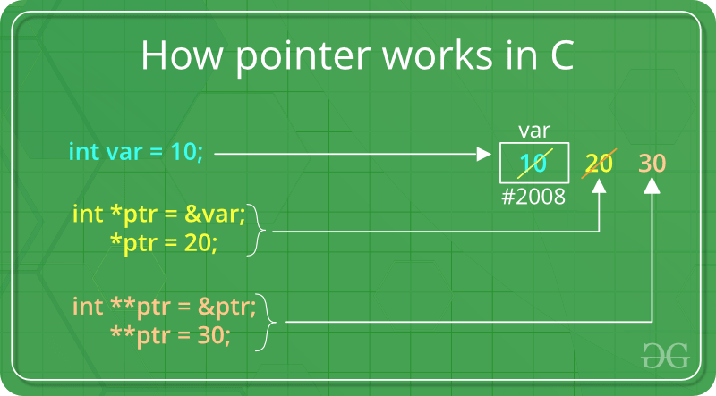

> Указатель - это переменная, которая хранит адрес другой переменной. Указатели используются для доступа к данным, которые хранятся в других частях памяти. Указатели могут быть использованы для передачи больших массивов в функцию, для возврата нескольких значений из функции, для динамического выделения памяти и для реализации связанных списков и других структур данных.

## Объявление указателя
Объявление указателя происходит с помощью оператора `*`:
```c++
int *p; // p - указатель на переменную типа int
float *q; // q - указатель на переменную типа float
int **r; // r - указатель на указатель на переменную типа int
```

## Операторы
Операторы, которые используются для работы с указателями:
* `&` - возвращает адрес переменной
* `*` - возвращает значение переменной, которая хранится по адресу, который хранится в указателе
* `->` - возвращает значение переменной, которая хранится по адресу, который хранится в указателе

Пример:
```c++
#include <iostream>

using namespace std;

int main() {
    int a = 5;
    int *p = &a; // p хранит адрес переменной a
    cout << p << endl; // 0x7ffeeb5b9f7c
    cout << *p << endl; // 5
    return 0;
}
```

<p align="center"></p>

## Указатели и массивы
Указатели могут быть использованы для доступа к элементам массива. Для этого используется оператор `[]`:
```c++
int main() {
    int a[5] = {1, 2, 3, 4, 5};
    int *p = a; // p хранит адрес первого элемента массива a
    cout << p[0] << endl; // 1
    cout << p[1] << endl; // 2
    cout << p[2] << endl; // 3
    cout << p[3] << endl; // 4
    cout << p[4] << endl; // 5
    return 0;
}
```

> На самом деле обращение по индексу массива `p[i]` эквивалентно обращению по указателю `*(p + i)`:
```c++
int main() {
    int a[5] = {1, 2, 3, 4, 5};
    int *p = a; // p хранит адрес первого элемента массива a
    cout << *(p + 0) << endl; // 1
    cout << *(p + 1) << endl; // 2
    cout << *(p + 2) << endl; // 3
    cout << *(p + 3) << endl; // 4
    cout << *(p + 4) << endl; // 5
    return 0;
}
```
> Теперь вы знаете, что при обращении по индексу массива просто складывается адрес первого элемента массива с индексом. Именно поэтому работает такой код, в котором также складывается адрес массива с индексом:
```c++
int main() {
    int a[5] = {1, 2, 3, 4, 5};
    cout << 0[a] << endl; // 1
    cout << 1[a] << endl; // 2
    cout << 2[a] << endl; // 3
    cout << 3[a] << endl; // 4
    cout << 4[a] << endl; // 5
    // Но так делать не стоит
    return 0;
}
```

## Динамическое выделение памяти
Для динамического выделения памяти используется оператор `new`:
```c++
int main() {
    int *p = new int; // выделяем память под одну переменную типа int
    *p = 5; // присваиваем значение 5
    cout << *p << endl; // 5
    delete p; // освобождаем память
    return 0;
}
```
> Обычно оператор `new` используется для выделения памяти под массив:
```c++
int main() {
    int *p = new int[5]; // выделяем память под 5 переменных типа int
    p[0] = 1;
    p[1] = 2;
    p[2] = 3;
    p[3] = 4;
    p[4] = 5;
    cout << p[0] << endl; // 1
    cout << p[1] << endl; // 2
    cout << p[2] << endl; // 3
    cout << p[3] << endl; // 4
    cout << p[4] << endl; // 5
    delete[] p; // освобождаем память
    return 0;
}
```

> Зачем выделять память под массив, если можно просто объявить массив? Потому что во-первых, размер массива может быть неизвестен во время компиляции. Динамическое выделение допускает заранее неизвестный размер массива. <br>А во-вторых, массивы, объявленные внутри функции, хранятся в стеке, а не в куче. Поэтому если массив объявлен внутри функции, то он будет уничтожен после выхода из функции. А если массив объявлен вне функции, то он будет храниться в куче, а не в стеке, и его можно будет использовать в других функциях.